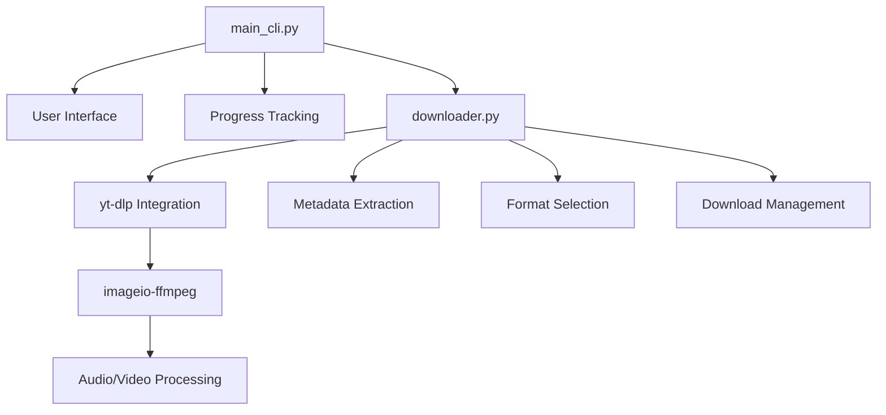

---
{"publish":true,"title":"Load - YouTube Downloader","description":"A beautiful command-line tool for downloading YouTube videos and audio","created":"2025-09-04T19:24:14.030+03:00","modified":"2025-09-04T19:34:02.964+03:00","tags":["python","cli","youtube","downloader","zainos"],"cssclasses":""}
---


# Load - YouTube Downloader

> [!info] Project Information
> **License:** GPL-3.0 | **Author:** khomod | **Project:** ZainOS | **Language:** Python

## Overview

Load is a beautiful and intuitive command-line tool for downloading YouTube videos and audio. Built as part of the ZainOS project, it focuses on providing a polished user experience with zero external dependencies in its compiled form.

### Key Features

- **High-Quality Video Downloads:** Choose from available MP4 video qualities
- **Audio Extraction:** Save audio tracks as MP3, WAV, or FLAC
- **Beautiful CLI Interface:** Powered by Rich library with progress bars and interactive prompts
- **Self-Contained Executables:** No Python or FFmpeg installation required
- **Cross-Platform Support:** Pre-built binaries for Windows, macOS, and Linux
- **Clean Output:** Silent operation with elegant progress tracking

### Quick Links

- [[CLI/load#installation\|Installation Guide]]
- [[CLI/load#usage\|Usage Guide]]
- [[CLI/load#development\|Development Setup]]
- [[CLI/load#architecture\|Architecture]]
- [[CLI/load#contributing\|Contributing]]

## Installation

### Option 1: Pre-built Binaries (Recommended)

Download the latest release for your operating system:

**[Download Latest Release](https://github.com/omar-Suleiman14/load/releases/latest)**

#### Windows
```bash
# Download load-windows.exe
.\load-windows.exe
```

> [!warning] Windows Security
> Windows Defender might show a warning. Click "More info" → "Run anyway"

#### macOS
```bash
# Download load-macos
chmod +x ./load-macos
./load-macos
```

> [!note] macOS Security
> Go to System Settings → Privacy & Security → Click "Open Anyway" for blocked app

#### Linux
```bash
# Download load-linux
chmod +x ./load-linux
./load-linux
```

### Option 2: From Source

#### Prerequisites
- Python 3.7+
- pip

#### Installation Steps
```bash
git clone https://github.com/omar-Suleiman14/load.git
cd load

# Create virtual environment
python -m venv venv

# Activate virtual environment
# Windows:
.\venv\Scripts\activate
# macOS/Linux:
source venv/bin/activate

# Install dependencies
pip install -r requirements.txt

# Run the application
python main_cli.py
```

## Usage

### Basic Workflow

1. **Launch the application**
2. **Enter a YouTube URL** (or type 'exit' to quit)
3. **Choose download type:**
   - Video (with quality selection)
   - Audio only (with format selection)
4. **Monitor progress** with the built-in progress bar
5. **Post-download options:**
   - Download another video
   - Open Downloads folder
   - Exit

### Command Examples

```bash
# Run from executable
./load-linux

# Run from source
python main_cli.py
```

### Interface Preview

```text
██╗      ██████╗  █████╗ ██████╗ 
██║     ██╔═══██╗██╔══██╗██╔══██╗
██║     ██║   ██║███████║██║  ██║
██║     ██║   ██║██╔══██║██║  ██║
███████╗╚██████╔╝██║  ██║██████╔╝
╚══════╝ ╚═════╝ ╚═╝  ╚═╝╚═════╝ 
```

### Video Quality Options

The application automatically detects and presents available video formats:
- 1080p, 720p, 480p, 360p (MP4)
- File size estimates
- Quality notes (when available)

### Audio Format Options

- **MP3:** Standard compressed format
- **WAV:** Lossless uncompressed format  
- **FLAC:** Lossless compressed format

## Architecture

### Core Dependencies

```python
# requirements.txt
yt-dlp              # Core downloader engine
imageio-ffmpeg      # Self-contained FFmpeg
rich                # Beautiful CLI interface
```

### Component Overview



### Key Classes

#### `Downloader` (downloader.py)
- `fetch_metadata(url)`: Extracts video information
- `get_video_formats(metadata)`: Parses available video qualities
- `download_video(url, path, format_id, hook)`: Downloads video with audio
- `download_audio(url, path, format, hook)`: Downloads and converts audio

#### `SilentLogger` (downloader.py)
- Suppresses yt-dlp console output for clean UI
- Methods: `debug()`, `warning()`, `error()`

## Development

### Setting up Development Environment

```bash
# Clone repository
git clone https://github.com/omar-Suleiman14/load.git
cd load

# Create virtual environment
python -m venv venv
source venv/bin/activate  # or .\venv\Scripts\activate on Windows

# Install dependencies
pip install -r requirements.txt

# Install development dependencies (if any)
pip install build pyinstaller  # for building executables
```

### Running Tests

```bash
# Test basic functionality
python main_cli.py

# Test with sample URL
# Enter: https://www.youtube.com/watch?v=dQw4w9WgXcQ
```

### Building Executables

```bash
# Install PyInstaller
pip install pyinstaller

# Build for current platform
pyinstaller --onefile --name load main_cli.py

# The executable will be in dist/
```

### Code Style

The project follows Python best practices:
- Docstrings for all classes and methods
- Type hints where appropriate
- Clean separation of concerns
- Error handling for network operations

### Key Design Decisions

- **Silent yt-dlp operation:** Custom logger class suppresses console output
- **Self-contained FFmpeg:** Uses imageio-ffmpeg for portability
- **Rich UI:** Progress bars and styled text for better UX
- **Error graceful handling:** User-friendly error messages

## API Reference

### Downloader Class Methods

#### `fetch_metadata(url: str) -> dict | None`
Extracts video metadata without downloading.

**Parameters:**
- `url`: YouTube video URL

**Returns:** Video metadata dictionary or None if invalid

**Example:**
```python
downloader = Downloader()
metadata = downloader.fetch_metadata("https://youtube.com/watch?v=...")
if metadata:
    print(f"Title: {metadata['title']}")
```

#### `get_video_formats(metadata: dict) -> list`
Parses metadata to return available video formats.

**Parameters:**
- `metadata`: Video metadata from fetch_metadata()

**Returns:** List of format dictionaries with id, display, resolution

#### `download_video(url, download_path, format_id, progress_hook)`
Downloads video with best audio and merges to MP4.

**Parameters:**
- `url`: YouTube video URL
- `download_path`: Target directory (Path object)
- `format_id`: Selected video format ID
- `progress_hook`: Callback function for progress updates

#### `download_audio(url, download_path, audio_format, progress_hook)`
Downloads and converts audio to specified format.

**Parameters:**
- `url`: YouTube video URL  
- `download_path`: Target directory (Path object)
- `audio_format`: Target format ('mp3', 'wav', 'flac')
- `progress_hook`: Callback function for progress updates

### CLI Functions

#### `display_welcome_screen()`
Shows styled logo and system information.

#### `get_user_url() -> tuple[str, dict] | tuple[None, None]`
Prompts for URL input with validation and exit option.

#### `run_download(url, choice, metadata)`
Handles the complete download process with progress tracking.

## Contributing

We welcome contributions to the Load project! This is part of the ZainOS learning initiative.

### Ways to Contribute

- **Bug Reports:** Found an issue? Open an issue on GitHub
- **Feature Requests:** Have ideas for improvements? Let us know
- **Code Contributions:** Submit pull requests with enhancements
- **Documentation:** Help improve documentation and examples
- **Testing:** Test on different platforms and report compatibility

### Development Guidelines

1. **Fork the repository** and create a feature branch
2. **Follow existing code style** and add docstrings
3. **Test your changes** on multiple platforms if possible
4. **Update documentation** if adding new features
5. **Submit a pull request** with clear description

### Bug Reports

When reporting bugs, please include:
- Operating system and version
- Python version (if running from source)
- Full error message or unexpected behavior
- Steps to reproduce the issue
- YouTube URL that caused the issue (if applicable)

### Feature Requests

For feature requests, please describe:
- The problem you're trying to solve
- Your proposed solution
- Any alternative solutions considered
- Additional context or examples

## Troubleshooting

### Common Issues

#### "FFmpeg not found" Error
- **Solution:** This shouldn't happen with proper installation as we bundle imageio-ffmpeg
- **Check:** Verify imageio-ffmpeg is installed: `pip list | grep imageio`

#### Download Fails with Network Error
- **Check internet connection**
- **Verify YouTube URL is valid and accessible**
- **Some videos may be region-restricted or private**

#### Windows Antivirus Blocking Executable
- **Add exception** for the load executable in your antivirus
- **Download from official GitHub releases** only

#### macOS "Unidentified Developer" Warning
- **Solution:** System Settings → Privacy & Security → Click "Open Anyway"
- **Alternative:** Run `xattr -d com.apple.quarantine ./load-macos`

### Getting Help

- **GitHub Issues:** [Report bugs and ask questions](https://github.com/omar-Suleiman14/load/issues)
- **Discussions:** Use GitHub Discussions for general questions
- **Documentation:** Check this documentation for detailed information

## License

This project is licensed under the **GNU General Public License v3.0**.

### Key Points of GPL-3.0

- [x] **Commercial use allowed**
- [x] **Modification allowed** 
- [+] **Distribution allowed**
- [+] **Private use allowed**
- [!] **Must include license and copyright**
- [!] **Must state changes made**
- [!] **Must disclose source code**
- [-] **No liability or warranty**

See the [LICENSE](./LICENSE) file for full license text.

## About ZainOS Project

Load is proudly part of the **ZainOS Project** - an educational initiative focused on:

- **Learning through building** practical tools
- **Developing programming skills** in real projects  
- **Creating polished utilities** that solve real problems
- **Open source collaboration** and knowledge sharing

### Project Maintainer

**khomod** - Creator and maintainer of the zainOS project series.

---

*Last updated: September 2025*